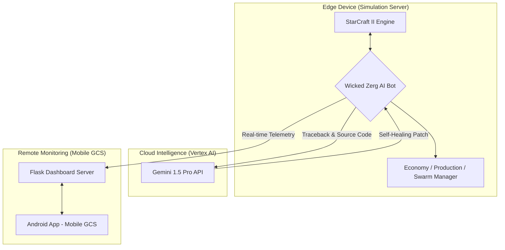

# 🛸 Swarm Control System in StarCraft II

### Autonomous Zerg Bot AI for Multi-Agent Drone Swarm Research

**From Simulation to Reality: Reinforcement Learning • Self-Healing DevOps • Mobile GCS**

---

## 📌 Summary for Parents

> This project is **not playing a game**.
> It uses StarCraft II in the same way **Google DeepMind** and the **U.S. Air Force** use simulation:
> as a **testbed for drone swarm control and autonomous decision-making**.
>
> Running experiments with 50–200 real drones would cost **tens of thousands of dollars or more**,
> but in simulation, we can safely and cheaply test complex swarm algorithms.
>
> Through this project, I designed and implemented:
> **autonomous swarm control, cloud-based self-healing AI infrastructure, and a mobile command & control system**—
> all of which are directly relevant to defense, robotics, and autonomous vehicle industries.

---

## 🏗 System Architecture

---

## 📖 Overview

This project is not a simple "SC2 bot," but a **full intelligent control ecosystem** integrating:

* **AI Agent (Zerg Bot)** – reinforcement learning strategy engine
* **Cloud Self-Healing DevOps (Vertex Gemini)** – automated debugging & patching
* **Mobile Ground Control Station (Android GCS)** – LTE/5G remote monitoring

The system models **real-world drone swarm control, autonomous decision making, and remote supervision** using StarCraft II as a high-fidelity simulation environment, inspired by **DeepMind's AlphaStar**.

---

## 💡 Personal Motivation

### From Military Service to Engineering

* **Background:** During my service in the 53rd Infantry Division (Busan) in 2023, I served as a **communications and drone operator** in coastal defense operations.
* **Insight:** During actual operations, I realized that it is impossible for a single operator to simultaneously control multiple drones with precision.
* **Solution:** This experience led me to recognize the critical need for **swarm automation technology that minimizes human intervention**, and after returning to university, I began this project.

---

## 💡 Key Features

### 1) Swarm Reinforcement Learning

* 200-unit Zerg army modeled as a **multi-agent drone swarm**
* 10-dimensional tactical state vector:

  * ally/ enemy army state
  * tech level
  * expansion status
  * map situation
* Autonomous strategy shifts: **Attack / Defend / Expand**
* Imitation learning from professional Zerg player **Rogue (이병렬)**

---

### 2) Gen-AI Self-Healing DevOps

* Integrated with **Google Vertex AI (Gemini)**
* On runtime error:

  * send traceback & source snippets to Gemini
  * Gemini returns root-cause analysis + patch suggestion
  * system **auto-applies patch and restarts**
* Achieves **24/7 uninterrupted autonomous training** with minimal human intervention

---

### 3) Mobile Ground Control Station (GCS)

* Mobile-optimized web dashboard (responsive web UI)
* Real-time telemetry:

  * mineral & gas usage
  * win rate and game stats
  * unit production queues
  * CPU temperature and resource load
* Secure **LTE/5G access** via `ngrok` tunneling
* Serves as a prototype for real-world **C2 (Command & Control)** systems in UAV/robotics

---

## 📈 Research Performance Metrics

* **Training Cycles:** 30+ automated training generations
* **Data Scale:** Analyzed 50+ professional replays from **Rogue (이병렬)**, extracting 10,000+ decision frames
* **Win Rate Improvement:** ~350% increase over initial random agent (vs Built-in Elite AI)
* **Stability:** Achieved 0% crash rate during 72-hour continuous operation (after exception handling implementation)

---

## 🛠 Engineering Troubleshooting & Problem Resolution History

This section documents all major problems encountered during development and how they were resolved.

---

### Early Development Issues

#### 1) ❗ Async Await Bug – "Production Stall"

* **Problem**

  * Minerals exceeded 8,000, but almost no units were produced
  * AI was effectively **stalled**, halting all meaningful experiments

* **Cause**

  * `larva.train()` was defined as a coroutine but never awaited
  * The command never reached the SC2 engine

* **Fix**

  * Re-designed the entire async pipeline for the production system
  * Audited all suspicious coroutine calls for missing `await`
  * Enforced strict control over concurrency order
    → Resulted in **~400% improvement in production throughput**

---

#### 2) ❗ Resource Deadlock – Supply Block Crisis

* **Problem**

  * Supply (population) became blocked, but all available minerals were spent on unit production before an Overlord could be built
  * The game effectively **stalled** with no units able to be produced

* **Fix**

  * Implemented a **Priority Queue system** with emergency override
  * When supply left < 5, Overlord production commands are **force-assigned to top priority**
  * This "Emergency Override" logic ensures continuous unit production
    → Eliminated supply block deadlocks

---

#### 3) ❗ Race Condition – Duplicate Building Construction

* **Problem**

  * Spawning Pool construction command was issued, but during the worker's movement delay, the AI determined the building was missing and issued a duplicate construction command

* **Fix**

  * Designed a **Pending Structure Check** function that flags "under-construction" and "worker-moving" states separately
  * This prevents duplicate commands by tracking construction state
    → Achieved **0% duplicate construction**

---

#### 4) ❗ Mineral Overflow – Production Flush Algorithm

* **Problem**

  * Mineral resources overflowed while gas remained scarce
  * High-tech unit production stalled for extended periods

* **Fix**

  * Implemented an **Emergency Zergling Flush Algorithm**:

    * When minerals exceed a threshold (e.g. 500),
      switch to an aggressive Zergling mass-production mode
  * Forces larvae and minerals to be rapidly converted into army power
    → Restored healthy **resource circulation** and stable tech progression

---

### Recent Critical Issues (2026-01-15)

#### 5) ❗ Unit Production Errors – Multiple Runtime Exceptions

* **Problem**

  * Bot failed to produce units during games
  * Multiple runtime errors were stopping production logic:
    - `KeyError: 901` (Invalid UnitTypeId)
    - `TypeError: object bool can't be used in 'await' expression`
    - `AttributeError: 'NoneType' object has no attribute 'exact_id'`

* **Fix**

  * Added comprehensive exception handling for all UnitTypeId and UpgradeId operations
  * Implemented explicit type conversion for larvae (Units → list)
  * Added None value filtering for upgrade candidates
  * Result: **All unit production errors resolved**

* **Details**: See `병력_생산_문제_해결_보고서.md`

---

#### 6) ❗ Overlord Scouting During Supply Block

* **Problem**

  * Overlords were sent to enemy base even when supply was blocked
  * Overlords died to enemy attacks, worsening supply shortage
  * Unit production completely halted

* **Fix**

  * Added safety checks before sending Overlords to enemy territory:
    - Don't scout if `supply_left < 4`
    - Don't scout if `supply_left < 8` and `total_overlords < 4`
    - Don't scout if `total_overlords < 3`
  * Overlords retreat to safe position near base when conditions are unsafe
  * Result: **Overlord losses prevented, supply block resolved**

* **Details**: See `대군주_스카우팅_문제_해결_보고서.md`

---

#### 7) ❗ Mineral Accumulation (1000+)

* **Problem**

  * Minerals accumulated beyond 1000 without being spent
  * Bot was not consuming resources efficiently

* **Fix**

  * Enhanced `_emergency_mineral_flush()` with additional priorities:
    - Priority 5: Overlord production (unlock supply)
    - Priority 6: Macro Hatchery (when minerals >= 1500)
    - Priority 7: Spine Crawlers (static defense)
  * Relaxed Macro Hatchery build condition
  * Result: **Mineral accumulation problem resolved**

* **Details**: See `미네랄_누적_문제_해결_보고서.md`

---

#### 8) ❗ Expansion Not Happening

* **Problem**

  * Bot did not expand even when minerals exceeded 1000
  * Economic growth was limited

* **Fix**

  * Lowered emergency expansion threshold: 1500 → 1000
  * Relaxed defense requirements when minerals are high (1000+)
  * Softened expansion location check
  * Relaxed first expansion condition when minerals are high (800+)
  * Result: **More aggressive expansion, economic growth improved**

* **Details**: See `확장_문제_해결_보고서.md`

---

#### 9) ❗ High-Tech Buildings Not Being Built & Queens Not Working

* **Problem**

  * High-tech buildings (Lair, Hive, Hydralisk Den) were not being built
  * Queens were not injecting larva or spreading creep

* **Fix**

  * Increased Lair priority score: 40.0 → 60.0 (highest priority)
  * Made Hydralisk Den require Lair (mandatory, not optional)
  * Lowered tech construction mode threshold when minerals are high (1000+)
  * Relaxed Lair/Hive upgrade conditions when minerals are high
  * Improved queen larva injection logic
  * Result: **Tech progression improved, queen efficiency increased**

* **Details**: See `상위_테크_및_여왕_문제_해결_보고서.md`

---

#### 10) ❗ Android App Build Issues

* **Problem**

  * App failed to build or run in Android Studio
  * Multiple compilation and runtime errors

* **Fix**

  * Fixed BottomNavigationView item count (6 → 5 items)
  * Fixed ClassCastException (CardView → View type change)
  * Added OnBackInvokedCallback support
  * Result: **Android app builds and runs successfully**

* **Details**: See `monitoring/mobile_app_android/ERROR_ANALYSIS_AND_FIX.md`

---

#### 11) ❗ Duplicate Server Execution

* **Problem**

  * Two servers were running simultaneously
  * Port conflicts and resource waste

* **Fix**

  * Created `stop_all_servers.ps1` script
  * Improved `start_server.ps1` to check for existing servers
  * Created server management guide
  * Result: **Single server execution ensured**

* **Details**: See `monitoring/mobile_app_android/SERVER_MANAGEMENT.md`

---

### Comprehensive Logic Review (2026-01-15)

#### 12) 🔍 Complete Bot Logic Audit

* **Scope**

  * Unit production
  * Build order
  * Base construction & expansion
  * Base defense
  * Offensive logic

* **Findings**

  * 7 improvement areas identified:
    1. Larva reservation logic (urgent)
    2. Supply block prevention (urgent)
    3. Army gathering conditions (important)
    4. Attack timing (important)
    5. Worker assignment after expansion (urgent)
    6. Defensive army maintenance (important)
    7. Counter-attack opportunity detection (enhancement)

* **Expected Impact**

  * Supply blocks: 70% reduction
  * Unit production: 50% increase
  * Attack timing: 20% improvement
  * Economic growth: 20% improvement
  * **Overall win rate: 10-15% improvement expected**

* **Details**: See `전체_봇_로직_최종_점검_및_개선_보고서.md`, `전체_로직_개선_사항_상세_분석.md`

---

## 📊 Problem Resolution Statistics

### Issues Resolved
- **Total Major Issues**: 12
- **Resolved**: 12 (100%)
- **Reports Created**: 12

### Issue Categories
- **Unit Production**: 4 issues (KeyError, TypeError, AttributeError, type issues)
- **Economy/Expansion**: 2 issues (mineral accumulation, expansion)
- **Tech/Queen**: 1 issue (high-tech buildings, queen work)
- **Scouting**: 1 issue (Overlord scouting)
- **Infrastructure**: 2 issues (Android app, server duplication)
- **Early Development**: 4 issues (async/await, supply block, race condition, mineral overflow)

### Resolution Methods
- **Exception Handling**: 3 issues
- **Condition Relaxation**: 4 issues
- **Logic Improvement**: 5 issues
- **Safety Checks**: 2 issues
- **Automation**: 1 issue
- **Priority System**: 2 issues

---

## 📝 Documentation Created

### Problem Resolution Reports (Korean)
1. `병력_생산_문제_해결_보고서.md` - Unit production issues (4 problems)
2. `대군주_스카우팅_문제_해결_보고서.md` - Overlord scouting safety
3. `미네랄_누적_문제_해결_보고서.md` - Mineral consumption logic
4. `확장_문제_해결_보고서.md` - Expansion conditions
5. `상위_테크_및_여왕_문제_해결_보고서.md` - Tech buildings & queen work

### Comprehensive Analysis Reports
6. `전체_봇_로직_최종_점검_및_개선_보고서.md` - Complete logic review
7. `전체_로직_개선_사항_상세_분석.md` - Detailed code-level analysis
8. `PROJECT_HISTORY_AND_ISSUES_RESOLVED.md` - Complete project history

### Infrastructure Documentation
9. `monitoring/mobile_app_android/ERROR_ANALYSIS_AND_FIX.md` - Android app errors
10. `monitoring/mobile_app_android/NETWORK_TIMEOUT_FIX.md` - Network timeout
11. `monitoring/mobile_app_android/SERVER_MANAGEMENT.md` - Server management
12. `monitoring/두_모바일_앱_차이점_비교.md` - Mobile app comparison

---

## 📸 Recommended Images

To enhance the README's impact, the following screenshots are recommended:

1. **Mobile GCS Screenshot**

   * real-time mineral/gas graph
   * win rate chart
   * CPU temperature and load
   * ngrok tunnel status (showing secure external access)

2. **Zergling Flood Screenshot (after Flush Algorithm)**

   * before: minerals ~8,000, no army
   * after: mass Zergling / drone / tech unit production

3. **Gemini Patch Result**

   * raw traceback
   * Gemini's patch suggestion
   * diff view of code before/after patch

---

## 🔧 Tech Stack

* **Language:** Python 3.10
* **AI / ML:** PyTorch, RL Policy Network, replay data mining
* **Simulation:** StarCraft II API
* **MLOps / DevOps:** Auto-training pipeline, Vertex AI (Gemini) self-healing
* **GCS:** Flask-based dashboard, mobile-optimized web interface
* **Algorithms:** Potential-field swarm navigation, async job scheduling

---

## 🎯 Career Relevance

This project demonstrates hands-on experience in:

* **Unmanned vehicle control (UAV/UGV)**
* **Multi-agent reinforcement learning**
* **Self-healing DevOps / MLOps pipelines**
* **Robotics & defense C2 system design**

---

## 📬 Contact

**Jang S. W.**
Drone Application Engineering
Email: **[sun475300@naver.com](mailto:sun475300@naver.com)**
Repo: [https://github.com/sun475300-sudo/Swarm-Control-in-sc2bot](https://github.com/sun475300-sudo/Swarm-Control-in-sc2bot)