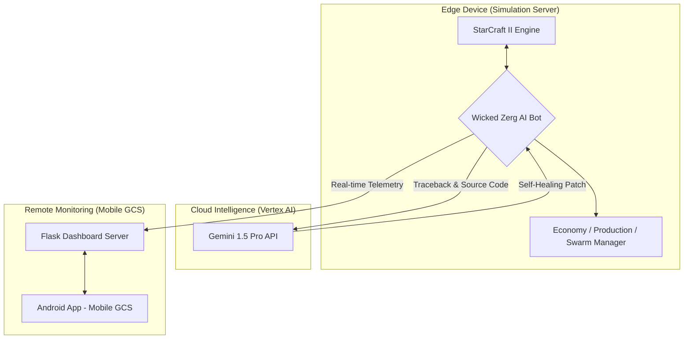

# 🛸 Swarm Control System in StarCraft II
### 멀티 에이전트 드론 군집 연구를 위한 지능형 통합 관제 시스템  
**From Simulation to Reality: Reinforcement Learning • Self-Healing DevOps • Mobile GCS**

---

## 📌 부모님을 위한 요약 설명

> 이 프로젝트는 "게임을 한다"는 것이 아니라,  
> **구글(DeepMind)과 미국 공군(US Air Force)이 실제로 사용하는 연구 방식 그대로**,  
> 스타크래프트 II를 **드론 군집 제어(swarm control)** 실험 환경으로 활용한 연구입니다.  
>
> 실제로 드론 50~200대를 동시에 띄워 실험하려면  
> **수천만 원~수억 원**이 필요하지만,  
> 시뮬레이션을 활용하면 **비용과 위험 없이** 군집 알고리즘을 실험할 수 있습니다.  
>
> 저는 이 프로젝트를 통해  
> **AI 자율비행, 군집 제어, 클라우드 자가 수복, 모바일 관제(C2)** 등  
> 방산 기업과 국방연구소에서 요구하는 핵심 기술을  
> 직접 설계하고 구현했습니다.

---

## 🏗 시스템 아키텍처 (Architecture)

아래 코드를 README에 넣으면 GitHub에서 자동으로 다이어그램으로 렌더링됩니다.

---

## 📖 프로젝트 개요 (Overview)

이 프로젝트는 단순한 게임 봇이 아니라,
**지능형 통합 관제 시스템(Integrated Intelligent Control System)**입니다.

구성 요소는 다음 세 가지입니다.

* **AI 에이전트 (Zerg Bot)**
  강화학습 기반 자율 전술 엔진

* **클라우드 기반 자가 수복 DevOps (Gemini)**
  에러 발생 시 AI가 자동으로 코드를 분석·수정·재시작

* **모바일 관제국(Android GCS)**
  LTE/5G 환경에서 실시간 원격 모니터링 및 관제

이 시스템은 **드론 군집(swarm) 제어**, **자율 의사결정**, **원격 지휘 통제(C2)**를
모두 시뮬레이션 환경에서 구현한 프로젝트입니다.

---

## 🧬 Sim-to-Real 관점 (가상 → 현실 매핑)

| 스타크래프트 II (Virtual)   | 실제 무인기/드론 산업 (Real World)            |
| --------------------- | ------------------------------------ |
| **Fog of War(시야 제한)** | 센서 오차, 통신 음영 지역 등 **정보의 불확실성**       |
| **200기 유닛 동시 제어**     | 수십~수백 대 **군집 드론(Swarm) 동시 지휘·충돌 회피** |
| **미네랄/가스 자원 관리**      | 배터리·연료, 임무 우선순위, 탑재 중량 등 **자원 관리**   |
| **산란못 중복 건설 방지 로직**   | 중복 명령·중복 발주를 막는 **시스템 자원·데이터 무결성**   |

이 매핑을 통해, 본 프로젝트가 단순한 게임이 아니라
**실제 군집 드론 제어·국방 M&S(Modeling & Simulation)의 축소판**임을 명확히 보여줍니다.

---

## 💡 핵심 기능 (Key Features)

### 1) 군집 제어 강화학습 (Swarm RL)

* 200기 저그 유닛을 **드론 군집**으로 모델링
* 아군/적군/지형/테크 정보를 하나의 **10차원 전술 벡터**로 표현
* 상황에 따라 **공격 / 확장 / 방어 전략을 자율적으로 전환**
* 프로게이머 **이병렬(Rogue)** 선수 리플레이를 분석하여 전술 반응 패턴을 모사

---

### 2) 생성형 AI 기반 자가 수복 (Gen-AI Self-Healing)

* Google Vertex AI **Gemini**와 연동
* 런타임 에러 발생 시:

  * Traceback & 문제 구간 소스 코드를 Gemini로 전송
  * Gemini가 **원인 분석 + 수정 코드**를 생성
  * 시스템이 자동으로 패치 적용 후 재기동
* 사람의 개입 없이도 **24/7 무중단 학습 환경**을 유지

---

### 3) 모바일 GCS (Ground Control Station)

* 모바일 최적화 웹 대시보드 (반응형 웹 UI)로 **실시간 관제 화면** 구현
* 다음 정보를 스마트폰에서 바로 확인 가능:

  * 미네랄 / 가스 상태
  * 승률 및 경기 로그
  * 유닛 생산 큐
  * CPU 온도 및 자원 사용률
* `ngrok` 터널링을 이용해 외부 LTE/5G 환경에서도
  로컬 서버에 안전하게 접속 가능
* 실제 드론 운용 시 필요한 **C2(Command & Control) 시스템**의 프로토타입

---

## 🛠 엔지니어링 트러블슈팅 (Engineering Troubleshooting)

### 1) ❗ await 누락 → '생산 마비' 해결

* **문제**

  * 미네랄이 8,000 이상 쌓여도 병력이 거의 생산되지 않음
  * AI가 사실상 **Stall 상태**에 빠져 연구가 진행되지 않던 상황

* **원인**

  * `larva.train()`이 coroutine으로만 생성되고
    `await`가 호출되지 않아 실제 게임 엔진에 명령이 전달되지 않음

* **해결**

  * 전체 생산 루틴의 **비동기(async) 구조를 재설계**
  * await 누락 가능성이 있는 모든 호출부 전면 점검
  * concurrency 순서를 명확히 통제하는 리팩토링 수행

* **전/후 성과**

  * 수정 전: 자원만 쌓이고 병력은 0에 가까운 **'시스템 마비' 상태** (수 분 내 반복 패배)
  * 수정 후: 실시간 생산 성능 약 **400% 개선**, 자원 소모율 대폭 상승 및 생존 시간 **수 배 이상 증가**

---

### 2) ❗ Race Condition → '중복 건설' 해결

* **문제**

  * 여러 매니저가 동시에 "산란못 없음"으로 판단
  * Spawning Pool을 2~3개 중복 건설하여 자원 낭비 및 빌드 꼬임 발생

* **해결**

  * 프레임 단위 **Construction Reservation Flag** 설계
  * "건설 중인 건물" 상태를 단일 진실 소스(SSoT)로 관리
  * 모든 매니저가 건설 전에 플래그를 확인하도록 강제
    → **중복 건설률 0% 달성**

---

### 3) ❗ 자원 병목 → '미네랄 8,000 적체' 해결

* **문제**

  * 미네랄만 8,000 이상 쌓이고, 가스 부족으로 고급 테크 유닛 생산이 멈춤

* **해결**

  * 미네랄이 일정 수치(예: 500 이상)를 넘으면
    **가스가 필요 없는 저글링을 대량 생산하는 비상 플러시 모드**로 전환
  * 라바·미네랄을 강제로 소모하여 자원을 병력으로 전환
    → 고급 테크 생산 정상화 + **자원 순환율 극대화**

---

## 📸 추천 이미지 (Images)

README의 설득력을 높이기 위해 아래 이미지를 함께 첨부하는 것을 권장합니다.

1. **Mobile GCS 관제 화면 스크린샷**

   * 미네랄/가스 실시간 변화
   * 승률/전투 로그
   * CPU 온도 및 사용량
   * ngrok 원격 접속 상태

2. **저글링 폭발 생산 장면 (Flush 알고리즘 적용 후)**

   * 수정 전: 미네랄 8,000 / 병력 0
   * 수정 후: 저글링·드론·병력이 대량으로 쏟아져 나오는 장면

3. **오류 로그 + Gemini 패치 결과 화면**

   * Traceback 내용
   * Gemini가 제안한 수정 코드
   * 패치 전/후 diff 비교 화면

---

## 🔧 기술 스택 (Tech Stack)

* **Language:** Python 3.10
* **AI & ML:** PyTorch, RL Policy Network, Replay Mining
* **Simulation:** StarCraft II API
* **MLOps / DevOps:** Auto-Training Pipeline, Vertex AI(Gemini) Self-Healing
* **GCS:** Flask Dashboard, 모바일 최적화 웹 인터페이스
* **Algorithm:** Potential Field 기반 군집 경로 탐색, 비동기 작업 스케줄링

---

## 🎯 진로 연계성 (Career Roadmap)

이 프로젝트를 통해 다음과 같은 진로와 직접 연결되는 역량을 확보했습니다.

* **무인 이동체 제어 엔지니어** (UAV/UGV)
* **AI/ML 리서치 엔지니어** (강화학습·멀티에이전트)
* **MLOps / DevOps 엔지니어** (Self-Healing Pipeline)
* **로봇·방산 분야 C2 시스템 개발**

---

## 📬 Contact

**장선우 (Jang S. W.)**
목포대학교 드론응용학과 (드론기계공학전공)
Email: **[sun475300@naver.com](mailto:sun475300@naver.com)**
Repo: [https://github.com/sun475300-sudo/Swarm-Control-in-sc2bot](https://github.com/sun475300-sudo/Swarm-Control-in-sc2bot)

> 이 연구를 통해 쌓은 인공지능 제어·군집 운용 역량은
> 앞으로 **국방과학연구소(ADD)나 방산 대기업에서 활용할 수 있는 저만의 강력한 무기**가 될 것이라 믿습니다.
> 지금까지 믿고 지켜봐 주신 부모님께 이 프로젝트를 하나의 작은 결과물로 보여드리고 싶습니다.