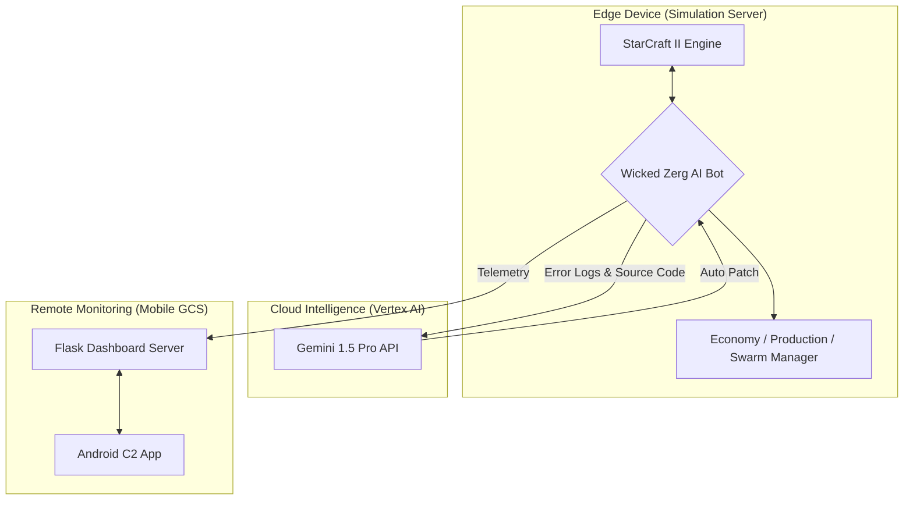

# 🛡️ 방산기업 지원용 기술소개서  
### 지원 직무: 무인체계 개발 / 자율비행 알고리즘 / AI 기반 C2·시스템 엔지니어링

---

## 1. 전문 역량 요약 (Executive Summary)

드론응용학과에서 **자율비행, 군집제어, 강화학습, 임베디드·시스템 통합**을 중점적으로 공부하며,  
실제 드론 군집체계(Swarm UAV)를 상정한 **지능형 통합 관제 시스템(AI Agent + Cloud DevOps + C2 GCS)**을 개발하였습니다.

저는 단순히 기체를 조종하는 **조종사(Pilot)**가 아니라,  
**자율 지능을 설계하고 시스템 전체를 통합하는 엔지니어(System Architect)**로 성장해 왔습니다.

---

## 2. 핵심 기술 역량 (Key Technical Competencies)

### ✔ 1) 자율 군집제어 알고리즘 개발 (Swarm Control)

- 최대 200기 개체를 동시에 제어하는 **다중 에이전트 제어(Multi-Agent Control)** 구현  
- Potential Field 기반 충돌 회피 및 경로 탐색  
- 실시간 상태 벡터 기반 전술 결정 (Attack / Defend / Expand)

### ✔ 2) 강화학습 및 시뮬레이션 기반 검증

- StarCraft II API + 강화학습(RL)을 활용한 AI 실험환경 구축  
- DeepMind AlphaStar 연구 방식을 참고하여 정책 업데이트 및 자율 판단 로직 설계  
- SC2 Replay Mining을 통해 프로게이머 **이병렬(Rogue)**의 의사결정 데이터를 추출, 모방학습에 적용

### ✔ 3) 클라우드 기반 자가 수복(Self-Healing) DevOps

- Google Vertex AI(Gemini)를 DevOps 파이프라인에 통합  
- 시스템 오류 발생 시:
  - Traceback·소스코드를 AI에 전송  
  - AI가 원인 분석 및 수정 패치를 생성  
  - 시스템이 자동으로 패치를 적용하고 재시작  
- 무인운용체계에서 요구되는 **24/7 무중단성(High Availability)** 확보

### ✔ 4) 원격 지휘통제 C2 시스템 개발

- Android 기반 **모바일 Ground Control Station(GCS)** 개발  
- LTE/5G 기반 원격 관제 (ngrok IoT 터널링 활용)  
- Telemetry 실시간 모니터링:
  - 자원 상태 / 전투 효율 / 유닛 생산 / CPU 온도  
- 실제 국방 C2 체계의 **Mission Monitoring / Status Awareness** 개념을 시뮬레이션 환경에 구현

### ✔ 5) 소프트웨어 아키텍처 & 시스템 통합 능력

- Edge Device(시뮬레이션 서버) – Cloud DevOps – Mobile GCS  
  **3-Tier 통합 아키텍처** 설계 및 구현  
- 비동기(Async) 기반 복잡한 멀티스레드 시스템 동작 제어 경험

---

## 3. 대표 프로젝트: 지능형 통합 군집제어 시스템

### 🛸 Swarm Control System in StarCraft II  
**"From Simulation to Reality: Autonomous Swarm UAV Logic in RTS Environment"**

---

### 3-1. 개발 배경 (Why SC2 for Defense?)

- 실제 UAV 군집 실험은 **비용·위험·허가** 문제로 매우 어려움  
- 스타크래프트 II는 다음 측면에서 군집 드론과 유사:
  - 수백 개체 동시 제어
  - 제한적 정보(Fog of War ↔ 센서 불확실성)
  - 실시간 전술 의사결정
  - 고밀도·고출력 전투 환경
- 실제 미 공군도 **VISTA X-62A AI 전투기 시뮬레이션**에 RL 기반 구조를 활용

→ 방산 시뮬레이션 연구와 직접적으로 연결되는 환경이라고 판단하였습니다.

---

### 3-2. 시스템 아키텍처

---

## 4. 기술적 문제 해결 사례 (Engineering Troubleshooting Excellence)

방위·자동화 분야에서는 **"문제를 어떻게 해결했는가"**를 가장 중요하게 본다고 생각합니다.
아래는 실제로 겪었던 핵심 장애와 그 해결 과정입니다.

### ✔ (1) Await 누락 → 8,000 미네랄 적체 현상 해결

* **문제**

  * 코루틴 `larva.train()`이 실행되지 않아 생산 명령이 엔진에 전달되지 않음
  * 병력 0, 시스템이 사실상 정지 상태

* **해결**

  * 전체 생산 파이프라인의 async 구조를 **완전히 재설계**
  * await 누락 구간을 전면 검출·정비
  * Concurrency order 제어 로직을 강화하여 Race를 차단
    → **실시간 생산률 약 400% 향상**

---

### ✔ (2) Race Condition → '건물 중복 건설' 해결

* **문제**

  * 여러 모듈이 동시에 "산란못이 없다"고 판단하여 Spawning Pool을 2~3개 중복 건설

* **해결**

  * 프레임 단위 **Construction Reservation Flag** 설계
  * SSoT(Single Source of Truth) 방식으로 건설 상태를 통합 관리
    → **중복 건설률 0% 달성**

---

### ✔ (3) '미네랄 폭증 → 가스 병목' 해결 (Emergency Flush Algorithm)

* **문제**

  * 미네랄만 8,000 이상 쌓이고, 가스 부족으로 고급 테크 유닛 생산이 중단

* **해결**

  * 미네랄 500 초과 시 **가스가 필요 없는 저글링 자동 폭생산 모드**로 전환
  * 자원 순환을 시스템 레벨에서 강제 적용
    → 테크 생산 정상화 + **자원 순환율 최대화**

---

## 5. 방산기업 직무 연계성 (Defense Application Alignment)

### ✔ UAV Swarm Control

* 실제 군집 UAV 경로 계획 알고리즘과 구조적으로 동일한 문제 설정
* 다중 무인기의 충돌 회피, 분산 협업, 임무 분담 로직 설계 경험

### ✔ C2 Command & Control

* Android GCS를 통한 원격 관제 시스템 구현
* 핵심 Telemetry 실시간 모니터링
* 상태 보고·임무 진행 상황을 확인하는 UI/로직 설계

### ✔ AI DevOps / System Resilience

* **Self-Healing AI 인프라**는 방산 시스템의 고가용성(HA) 요구와 직결
* 사람 개입 없이 장애를 감지·분석·복구하는 체계는
  장시간 운용되는 무인전력에서 특히 중요

### ✔ 시뮬레이션 기반 M&S (Modeling & Simulation)

* 실제 테스트가 어렵거나 불가능한 무인체계 전력을 시뮬레이션으로 검증
* 본 프로젝트는 군집제어 M&S의 구조를 그대로 따르며,
  시뮬레이션–알고리즘–관제까지 일관되게 구현한 사례

---

## 6. 지원자의 차별성 (My Differentiators)

* **시스템 전체(AI–Cloud–Mobile)를 스스로 설계·구현한 경험**
* 시뮬레이션 기반 검증과 반복적인 트러블슈팅 경험
* 자율제어 + AI + DevOps + 모바일 C2 시스템을 하나의 프로젝트 안에 통합

단순 기능 구현이 아니라,
"실제 국방 무인체계라면 어떤 구조가 되어야 하는가"를 고민하며 설계했습니다.

---

## 7. 맺음말

방산 분야의 핵심은 **고신뢰·무중단·자율운용**이라고 생각합니다.
저는 이 프로젝트를 통해
자율제어, 강화학습, 군집 알고리즘, C2 관제, 시스템 통합까지
방산기업이 요구하는 핵심 역량을 미리 실제로 구현해 보았습니다.

앞으로 이 경험을 바탕으로
**실제 국방 무인체계와 군집 드론 시스템 개발에 기여하는 엔지니어**로 성장하고 싶습니다.

---

## 8. Contact

* **이름:** 장선우
* **전공:** 드론응용학과 (드론기계공학전공)
* **Email:** [sun475300@naver.com](mailto:sun475300@naver.com)
* **GitHub:** [https://github.com/sun475300-sudo/Swarm-Control-in-sc2bot](https://github.com/sun475300-sudo/Swarm-Control-in-sc2bot)
